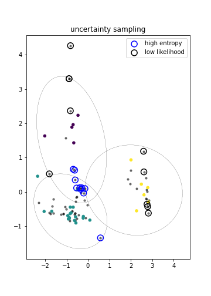
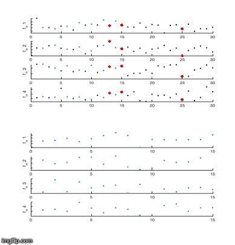
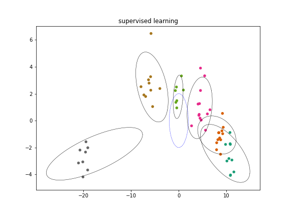
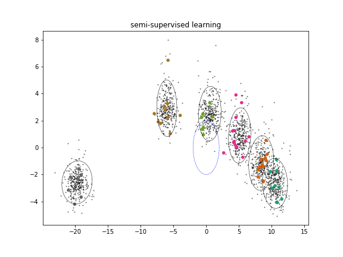
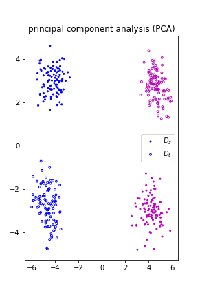
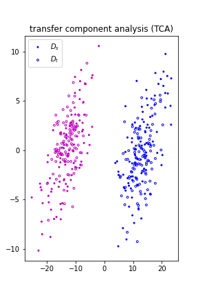

# Engineering Pattern Recognition

Code to reproduce paper results (or as close as possible, depending on data-availability). Each publication has a Jupyter notebook.

Mostly probabilistic/Bayesian ML for engineering applications, particularly performance and health monitoring. Scripts are provided to test and demonstrate the 'EPR' module.

This is a work-in-progress, so far:

## Features

### Active learning

### Semi-supervised learning

### Transfer learning: TCA domain adaptation

 

Archived MATLAB functions/scripts are available in the matlab folder.