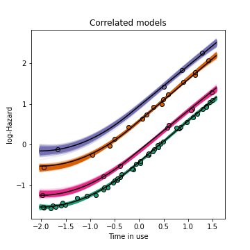
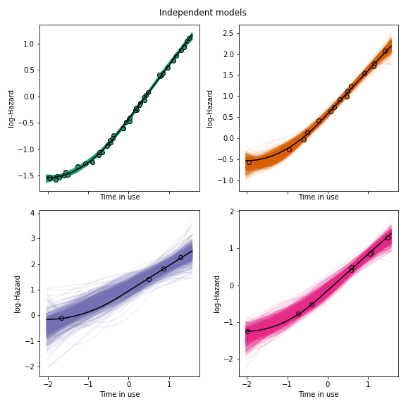

# Engineering Pattern Recognition

Code to reproduce paper results (or as close as possible, depending on 
data-availability). Each publication has a Jupyter notebook.

Mostly probabilistic/Bayesian ML for engineering applications, particularly 
performance and health monitoring. Scripts are provided to test and 
demonstrate the _EPR_ module.

This is a work-in-progress.

---
## Algorithms

* Multitask Learning
    * [Hierarchical regression](https://www.taylorfrancis.com/books/mono/10.1201/9780429258411/bayesian-data-analysis-andrew-gelman-john-carlin-hal-stern-donald-rubin) (Stan)

* Domain Adaptation
  * [Transfer Component Analysis](https://ieeexplore.ieee.org/stamp/stamp.jsp?arnumber=5640675&casa_token=Go7wJy20s-QAAAAA:-LZaw0y0LDV7TFK4ClCSoDbsPWF87A-GD2iklRy3ObjxL7A0lanOe92vM-UCd_WwJY7th6R3-SE) (TCA)
  * \[Forthcoming\]: Domain Adapted Gaussian Mixture Models (GMMs)

* Partially-supervised learning
  * [Active learning by uncertainty sampling in Gaussian Mixture Models](https://doi.org/10.1016/j.ymssp.2019.106294) 
    (GMMs)
  * [Semi-supervised learning of mixture models](https://www.morganclaypool.com/doi/pdfplus/10.2200/S00196ED1V01Y200906AIM006?casa_token=0YqCaqxyR1EAAAAA:v8kqB5LBhkclcS30fp0z9DOELXhwlPrqZV2YjJiAK2CuGAPNVoDgId_bODlX6mifibxb1ozTbio) 
  via (MAP) expectation 
    maximisation
  * [Hierarchical sampling for active learning](https://dl.acm.org/doi/pdf/10.1145/1390156.1390183?casa_token=MaX0vwAsl9kAAAAA:ADzBT6YbRvKUh6DfZOGB1O-eqO8q7v1JLTBLgcN263vjoROp4D6wc3MHkcwxMzX20cgPimPI-Ibx6g)
   (the DH active learner)

---
## Papers and Notebooks

* \[Forthcoming\]: [Knowledge transfer in engineering fleets: Hierarchical 
  Bayesian modelling for multitask learning (ArXiv, 2022)](link)
  * Hierarchical regression models of engineering populations, allowing 
    knowledge transfer between subgroups
  * Applications to truck fleet survival analysis and wind farm power 
    prediction.
  * Jupyter notebook [demo](/Knowledge-transfer-in-engineering-fleets.ipynb) 
    based on truck-fleet survival analysis.

* [On the transfer of damage detectors between structures: an experimental 
  case study (JSV, 2021)](https://doi.org/10.1016/j.jsv.2021.116072)
  * Domain adaptation to transfer novelty detectors between aircraft 
    tailplane ground-tests.
  * The [TCA code](/TCAdemo.py) used in the papers.

* [Towards semi-supervised and probabilistic classification in structural 
  health monitoring (MSSP, 2020)](https://doi.org/10.1016/j.ymssp.2020.106653)
  * Semi-supervised learning of GMMs via (MAP) expectation maximisation, 
    applied to Gnat aircraft ground-test data to utilise _both_ labelled 
    and unlabelled data.
  * Jupyter notebook 
  [demo](/Semi-supervised-and-probabilistic-classification-in-SHM-MSSP2020.ipynb); 
  MATLAB [demo](/matlab/semi_supervised_GMM).

* [Probabilistic active learning: An online framework for structural health 
  monitoring (MSSP, 2019)](https://doi.org/10.1016/j.ymssp.2019.106294)
  * Uncertainty sampling (GMMs) to direct inspections from online data 
    streams from engineering systems. Applied to bridge, lathe, and
    aircraft monitoring datasets.
  * Jupyter notebook 
  [demo](Probabilistic-active-learning-An-online-framework-for-SHM-MSSP2019.ipynb); 
  MATLAB [demo](matlab/active_learning_GMM).

* [Active learning for semi-supervised structural health monitoring (JSV, 
  2018)](https://doi.org/10.1016/j.jsv.2018.08.040)
  * Hierarchical sampling for active learning (the DH active 
    learner) applied to learn a classifier for ground-test vibration data 
    from a Gnat aircraft.
  * MATLAB [demo](/matlab/cluster_based_active_learning).

---
## Figures

### Multitask learning (MTL)

MTL for transfer learning

Compared to independent models

### Active learning

### Semi-supervised learning

(The blue ellipse shows the prior)

### TCA domain adaptation (transfer learning)

 

Archived MATLAB functions/scripts are available in the matlab folder.