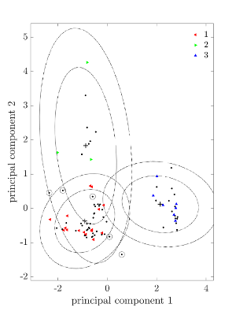
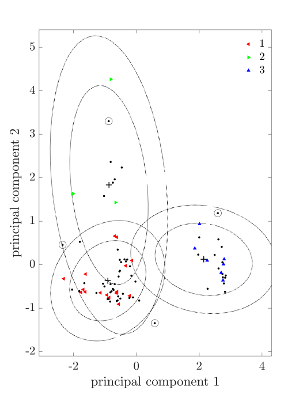
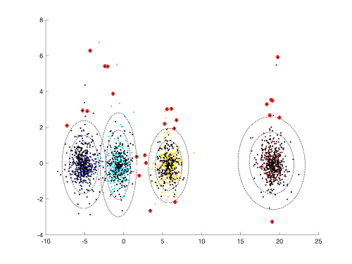
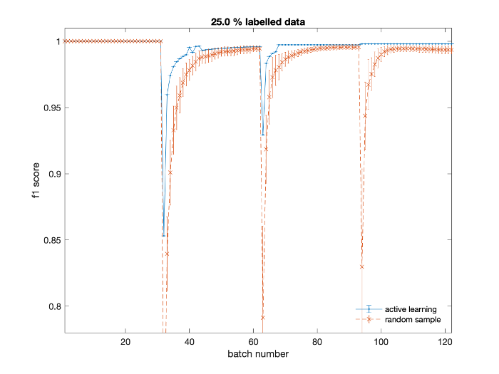
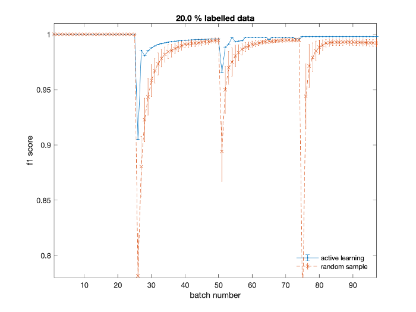
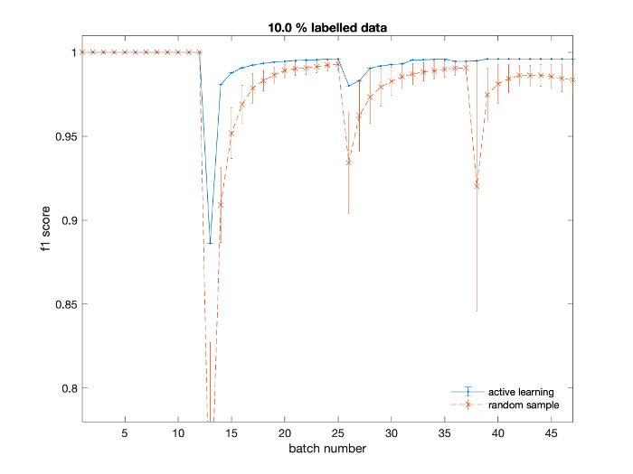
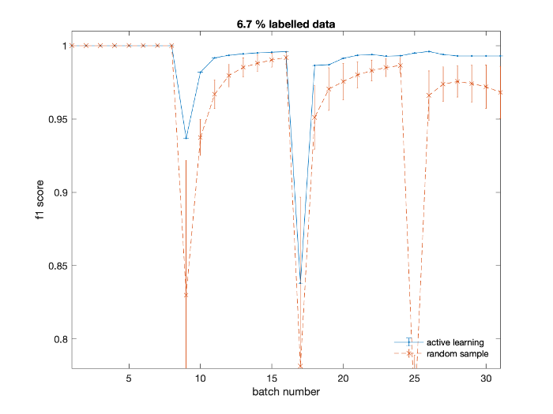

# Probabilistic Active Learning: Uncertainty Sampling [MATLAB]

- This code implements active learning through uncertainty sampling within a Gaussian Mixture Model (GMM), considering applications to streaming data.
- The code was written for engineering applications (structural health monitoring), implementation details can be found in [this paper](https://www.sciencedirect.com/science/article/pii/S0888327019305096), published in Mechanical Systems and Signal Processing (MSSP).

## Active Learning
Active learning is motivated by scenarios where providing labels `Y` for the measured signals `X` is impracticable and/or expensive. An active learner will query/annotate unlabelled data from `D_u` to automatically extend the labelled training-set `D_l`.

## The Algorithm: Uncertainty Sampling GMM
This algorithm assumes (for a limited query budget) that uncertain data, given the current model, are the most informative. Specifically, uncertain signals are those in `D_u` with *high Shannon entropy* for the label predictions and *low marginal-likelihood* given the current model estimate. Details and appropriate references are in the paper.

An example of uncertain data that would be selected by the active learner are shown below, for an acoustic emission dataset collected at Cardiff University (the example is taken from the MSSP paper).

*Highest Shannon entropy/Lowest marginal-likelihood:*

### Applications to streaming data
For applications to streaming data, the model initialises as a one component mixture, and adapts as new classes are discovered, leading to a generative multi-class classifier. The training-set is extended by selecting signals from the data-stream that are uncertain in terms of (low) likelihood and (high) entropy, and the GMM is updated accordingly.

A visual example is provided below, applied to the [Z24 data](https://onlinelibrary.wiley.com/doi/abs/10.1002/1096-9845(200102)30:2%3C149::AID-EQE1%3E3.0.CO;2-Z) as a three-class problem (see [this paper](https://www.sciencedirect.com/science/article/pii/S0888327019305096) for more details). The first plot shows the data available for training (labelled and unlabelled) - the red markers highlight uncertain queries made by the active learner. The second plot shows the (MAP) predicted labels, given (held-out) test-data.

### Demo script
A demo script (main.m) is provided with toy-data. The online classification performance (assessed via the `f1`-score) is shown to improve when the training-set is extended using uncertainty sampling (active learning) rather than random sampling (passive learning). The first figure shows the feature-space, and highlights the uncertain signals (red markers) that would be queried,

The second figure can demonstrate improvements in the online `f1`-score for various query budgets (per batch) `qn`.

### The dangers of active learning: sampling bias
Importantly, despite empirical improvements shown here and in the literature, selecting training data by a given measure (uncertainty or otherwise) can be worse than random sampling. The assumption of most classifiers is that the training data are representative of the underlying data distribution; this implies that samples are drawn i.i.d from the underlying probability density. However, in active learning, the samples that define the training set are guided; therefore, they are inherently *not* i.i.d. In consequence, care must be taken to ensure that the model does not become unrepresentative: it is critical that any application of active learning should consider the type (complexity) of data that is being analysed, the quantity of data that is available, and the query budget. An example of sampling bias in presented in the [MSSP paper](https://www.sciencedirect.com/science/article/pii/S0888327019305096).
